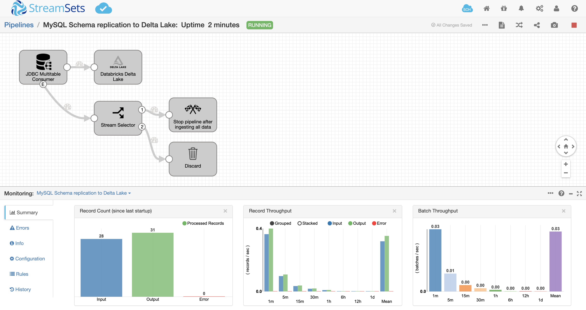

MySQL Schema replication to Delta Lake
==============================

This pipeline demonstrates how to bulk load data from MySQL into Databricks Delta Lake. You can select one or more MySQL schemas to replicate into Delta Lake with a single pipeline.

For more information, see [[Loading Data into Databricks Delta Lake](https://streamsets.com/documentation/datacollector/latest/help/index.html?contextID=concept_a5b_wvk_ckb "Loading Data into Databricks Delta Lake")](https://streamsets.com/documentation/datacollector/latest/help/index.html?contextID=concept_fjj_zcf_2w) in [StreamSets Data Collector documentation](https://streamsets.com/documentation/datacollector/latest/help/).

Prerequisites
-------------

* [StreamSets Data Collector](https://streamsets.com/products/dataops-platform/data-collector/) 3.15.0 or higher. You can [run Data Collector on your cloud provider of choice](https://streamsets.com/products/cloud/), or [download it for local use](https://streamsets.com/products/dataops-platform/data-collector/download/).
* Ensure the [pre-requisites](https://streamsets.com/documentation/datacollector/latest/help/index.html?contextID=concept_xnp_y5f_dlb "pre-requisites") for Databricks Delta Lake are complete
* [MySQL Server](https://www.mysql.com/)
* [MySQL Connector/J](https://dev.mysql.com/downloads/connector/j/) JDBC Driver

Setup
-----

* [Download the pipeline](MySQL%20Schema%20Replication%20to%20Delta%20Lake.json "Download the pipeline") and import it into Data Collector or Control Hub
* Configure all the pipeline parameters for your MySQL Database and Databricks connections
* Update the MySQL origin to read from specific schemas and/or tables
* By default, the Databricks Delta Lake destination is configured to auto create each table that is replicated from MySQL and write the data in DBFS. If you'd like, update the configurations in the destination per your needs.
* Start your Databricks cluster.

Running the Pipeline
--------------------

Start the pipeline. It takes a couple of seconds to create a connection to Databricks. Once the connection is established, you should see records ingested from MySQL and sent to Delta Lake. The pipeline is also configured to automatically stop after it's ingested all the data from MySQL. If you'd like to continue running the pipeline such that it incrementally ingests as data arrives in MySQL then remove 'Process Events' from the origin and all the stages connected to the Event Lane.

