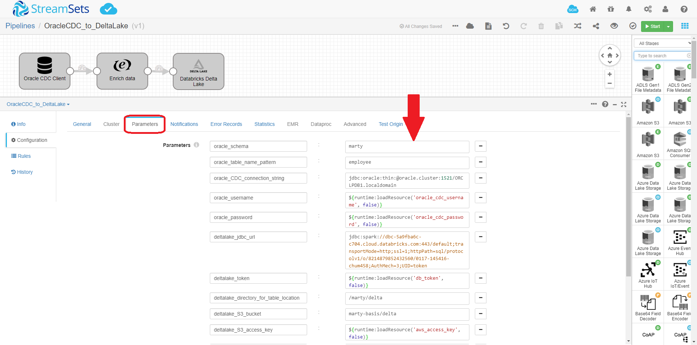
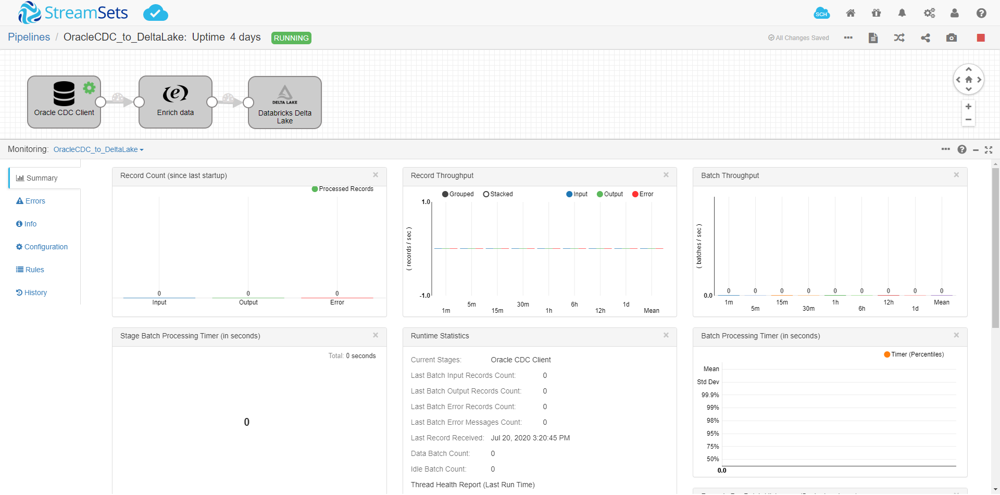
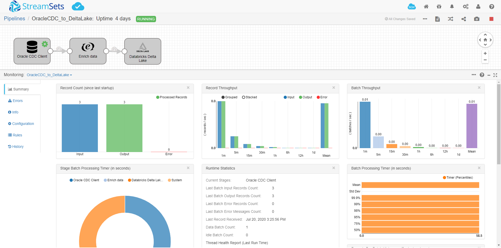

<h1>
Oracle CDC to Databricks Delta Lake
</h1>

# Oracle CDC to Databricks Delta Lake

**Important:** *These instructions assume you have access to StreamSets Data Collector (v3.15+) and have performed all the prerequisites for Oracle and Databricks Delta Lake*

- For help installing [StreamSets Data Collector](https://streamsets.com/products/dataops-platform/data-collector/), see [StreamSets Data Collector Installation](https://streamsets.com/documentation/datacollector/latest/help/datacollector/UserGuide/Installation/Install_title.html).
- For help with MySQL Binary Log prerequisites, see [Oracle CDC Client](https://streamsets.com/documentation/datacollector/latest/help/datacollector/UserGuide/Origins/OracleCDC.html).
- For help with Databricks Delta Lake prerequisites, see [Databricks Delta Lake](https://streamsets.com/documentation/datacollector/latest/help/datacollector/UserGuide/Destinations/DeltaLake.html).

For more information, see [Loading Data into Databricks Delta Lake](https://streamsets.com/documentation/datacollector/latest/help/index.html?contextID=concept_a5b_wvk_ckb) in [StreamSets Data Collector documentation](https://streamsets.com/documentation/datacollector/latest/help/).

Here is a link to a short video on using this pipeline template: [Video Link](https://www.youtube.com/channel/UC_4K-__dngOCEmoZs7PVZAg)

## OVERVIEW

This pipeline demonstrates how to read change data capture (CDC) data from an Oracle database and replicate the changes to Databricks Delta Lake.

**Disclaimer:** *This pipeline is meant to serve as a template for performing Oracle CDC to Databricks Delta Lake.  Some of the parameters, tables and fields may be different for your environment and may need additional customizations.  Please consult the StreamSets documentation (linked below) for full information on configuration of each stage used below.  For example, this pipeline has a single table defined with keys.  If you want to handle multiple tables, you will need to add them to the Delta Lake destination --> Data tab.*

## USING THE TEMPLATE

NOTE: [Templates](https://streamsets.com/documentation/controlhub/latest/onpremhelp/controlhub/UserGuide/Pipelines/PipelineTemplates.html) are supported in [StreamSets Control Hub](https://streamsets.com/products/dataops-platform/control-hub/). If you do not have Control Hub, you can import the template pipeline in Data Collector but will need to do that each time you want to use the template.

## PIPELINE

## DOCUMENTATION

[Oracle CDC Client](https://streamsets.com/documentation/datacollector/latest/help/datacollector/UserGuide/Origins/OracleCDC.html)

[Expression Evaluator](https://streamsets.com/documentation/controlhub/latest/help/datacollector/UserGuide/Processors/Expression.html)

[Delta Lake Destination](https://streamsets.com/documentation/controlhub/latest/onpremhelp/datacollector/UserGuide/Destinations/DeltaLake.html)

## STEP-BY-STEP

### Step 1: Download the pipeline

[Click Here](./OracleCDC_to_DeltaLake.zip?raw=true) to download the pipeline and save it to your drive.

### Step 2: Import the pipeline

Click the down arrow next to the "Create New Pipeline" and select "Import Pipeline From Archive".

Click "Browse" and locate the pipeline file you just downloaded, click "OK", then click "Import"

### Step 3: Configure the parameters

Click on the pipeline you just imported to open it and click on the "Parameters" tab and fill in the appropriate information for your environment.

**Important:** *The pipeline template uses the most common default settings for things like the region, staging location, etc. All of these are configurable and if you need to change those, you can opt to not use the built-in parameters and choose the appropriate settings yourself. Please refer to the documentation listed in this document for all the available options.*

The following parameters are set up for this pipeline:
<table>
  <tr>
                                    <td><code>oracle_schema</code></td>
                                    <td class="entry cellrowborder" headers="d442874e2435 ">Schema to use. You can enter a schema name or use <a class="xref" href="https://docs.oracle.com/database/121/SQLRF/conditions007.htm#SQLRF00501" target="_blank">SQL LIKE syntax</a> to
                                        specify a set of schemas.
The origin submits the schema
                                            name in all caps by default. To use a lower or
                                            mixed-case name, select the Case-Sensitive Names
                                            property.

</td>
                                </tr>
  <tr>
                                    <td><code>oracle_table_name_pattern</a></td>
                                    <td class="entry cellrowborder" headers="d442874e2435 ">Table name pattern that specifies the tables to track.
                                        You can enter a table name or use <a class="xref" href="https://docs.oracle.com/database/121/SQLRF/conditions007.htm#SQLRF00501" target="_blank">SQL LIKE syntax</a> to
                                        specify a set of tables. The origin submits table names in
                                        all caps by default. To use lower or mixed-case names,
                                        select the Case-Sensitive Names property.</td>
                                </tr>
  <tr>
   <td><code>oracle_CDC_connection_string</code>
   </td>
   <td class="entry cellrowborder" headers="d442874e2818 ">Connection string used to connect to the database.
                                            
Note: If you include the JDBC credentials in the
                                            connection string, use the user account created for the
                                            origin. Common user accounts for Oracle 12c, 18c, or 19c
                                            multitenant databases start with <code class="ph codeph">c##</code>.
                                            

</td>
  </tr>
  <tr>
   <td><code>oracle_username</code>
   </td>
   <td class="entry cellrowborder" headers="d442874e2925 ">Password for the account.
Tip: To
                        secure sensitive information such as user names and passwords, you can use
                              <a class="xref" href="../Pipeline_Configuration/RuntimeValues.html#concept_bs4_5nm_2s" title="Similar to runtime properties, runtime resources are values that you define in a file local to the Data Collector and call from within a pipeline. But with runtime resources, you can restrict the permissions for the files to secure information.">runtime resources</a> or <a class="xref" href="../Configuration/CredentialStores.html#concept_bt1_bpj_r1b">credential stores.</a>

</td>
  </tr>
  <tr>
   <td><code>oracle_password</code>
   </td>
   <td class="entry cellrowborder" headers="d436212e853 ">MySQL password.
Tip: To
                        secure sensitive information such as user names and passwords, you can use
                              <a class="xref" title="Similar to runtime properties, runtime resources are values that you define in a file local to the Data Collector and call from within a pipeline. But with runtime resources, you can restrict the permissions for the files to secure information.">runtime resources</a> or <a class="xref">credential stores.</a>

</td>
  </tr>
  <tr>
   <td><code>deltalake_jdbc_url</code>
   </td>
   <td class="entry cellrowborder" headers="d108933e1968 ">JDBC URL used to connect to the Databricks cluster.
For example:
                                                <code class="ph codeph">jdbc:spark://dbc-7g9hba4d-a123.cloud.databricks.com:443/default;transportMode=http</code>
                                            <code class="ph codeph">:ssl=1;httpPath=sql/protocolv1/o/89266567230988377/1123-1001003-abc1;AuthMech=3;UID=token;</code>

Tip: In Databricks, you can locate the
                                            JDBC URL for your cluster on the
                                                JDBC/ODBC tab in the cluster
                                            configuration details. As a best practice, remove the
                                                <code class="ph codeph">PWD</code> parameter from the URL, and
                                            then enter the personal access token value in the Token
                                            property below. 

</td>
  </tr>
  <tr>
   <td><code>deltalake_token</code>
   </td>
   <td class="entry cellrowborder" headers="d108933e1968 ">Personal access token used to connect to the Databricks
                                            cluster.
Tip: To secure sensitive information such as tokens,
                  you can use <a class="xref" title="Similar to runtime properties, runtime resources are values that you define in a file local to the Data Collector and call from within a pipeline. But with runtime resources, you can restrict the permissions for the files to secure information.">runtime resources</a> or <a class="xref">credential stores.</a>

</td>
  </tr>
  <tr>
   <td><code>deltalake_directory_for_table_location</code>
   </td>
   <td class="entry cellrowborder" headers="d108933e1968 ">Directory for the Delta table location, specified as a
                                        path on Databricks File System (DBFS). 
The destination adds
            the specified Table Name value as a subdirectory to create the final table location. For
            example, if you enter /mnt/deltalake as the directory for the table
            location and you enter <code class="ph codeph">sales.accounts</code> as the table name, the final
                table location is /mnt/deltalake/sales.accounts.

When you specify a location, the destination creates
                an unmanaged Delta table. When you do not specify a location, the destination
                creates a managed Delta table. For more information, see the <a class="xref" href="https://docs.databricks.com/delta/delta-batch.html#control-data-location" target="_blank">Delta Lake
                documentation</a>.

Available when data drift and automatic table
                                            creation are enabled.

</td>
  </tr>
  <tr>
   <td><code>deltalake_S3_bucket</code>
   </td>
   <td class="entry cellrowborder" headers="d108933e2196 "><b>** NOTE ** This template uses AWS S3 as the staging location.  If you want to use ADLS, you will need to change it in the Delta Lake Destination --> Staging tab and provide all necessary configuration.</b>
   
Bucket name or path to the existing Amazon S3 location to
                                        write the staged files.
Enter the bucket name or enter the
                                            full bucket path in the following
                                                format:

<code class="ph codeph">&lt;bucket&gt;/&lt;prefix&gt;</code>

Available
                                            when using the Amazon S3 staging location.

</td>
   </td>
  </tr>
  <tr>
   <td><code>deltalake_S3_access_key</code>
   </td>
   <td class="entry cellrowborder" headers="d108933e2196 ">AWS access key ID. 
Required when not using IAM roles
                                            with IAM instance profile credentials.

Available
                                            when using the Amazon S3 staging location.

</td>
  </tr>
  <tr>
   <td><code>deltalake_S3_secret_key</code>
   </td>
   <td class="entry cellrowborder" headers="d108933e2196 ">AWS secret access key. 
Required when not using IAM
                                            roles with IAM instance profile
                                            credentials.

Available when using the Amazon S3
                                            staging location.
Tip: To secure sensitive information such as
                  access key pairs, you can use <a title="Similar to runtime properties, runtime resources are values that you define in a file local to the Data Collector and call from within a pipeline. But with runtime resources, you can restrict the permissions for the files to secure information.">runtime resources</a> or <a>credential stores.</a>

</td>   
  </tr>
  <tr>
   <td><code>deltalake_database_name</code>
   </td>
   <td>The Delta Lake database name.
   </td>
  </tr>
  <tr>
   <td><code>deltalake_table</code>
   </td>
   <td>The Delta Lake table name.
   
<b>** NOTE ** The template can handle multiple different tables, but you need to configure all the tables and key columns in the Delta Lake destination --> Data tab.  See Appendix 1 below for details.</b>
   </td>
  </tr>
  <tr>
   <td><code>deltalake_key_column</code>
   </td>
   <td>The Delta Lake key column.
   
<b>** NOTE ** The template can handle multiple different tables, but you need to configure all the tables and key columns in the Delta Lake destination --> Data tab.  See Appendix 1 below for details.</b>
   </td>
  </tr>
</table>

### Step 4: Run the pipeline

Click the "START" button to run the pipeline.

### Step 5: Make changes to the MySQL source table and see the pipeline process them

