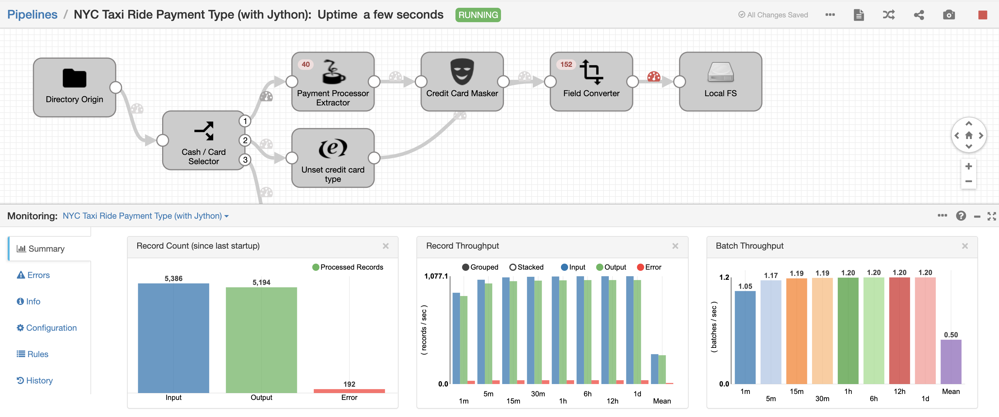

<h1>
NYC Taxi Ride Payment Type (with Jython processor)
</h1>

**Important:** *These instructions assume you have access to StreamSets Data Collector (v3.16+) and have performed all the prerequisites*

- For help installing [StreamSets Data Collector](https://streamsets.com/products/dataops-platform/data-collector/), see [StreamSets Data Collector Installation](https://streamsets.com/documentation/datacollector/latest/help/datacollector/UserGuide/Installation/Install_title.html).
- Ensure Jython stage library is installed. For instruction on how to install a stage library, refer to the [docs](https://streamsets.com/documentation/datacollector/latest/help/datacollector/UserGuide/Installation/AddtionalStageLibs.html)
- Download a sample data set from the following [location](https://www.streamsets.com/documentation/datacollector/sample_data/tutorial/nyc_taxi_data.csv). Place the file on the same host where Data Collector is running and provide read permissions to it.

## OVERVIEW

This pipeline demonstrates how to read data from a directory, process it, route it, mask sensitive data and write into another file system with a different data format. The pipeline also shows an example of how to use & configure a Data Rule.

## PIPELINE

")

## DOCUMENTATION

[Tutorial](https://streamsets.com/documentation/datacollector/latest/help/datacollector/UserGuide/Tutorial/BasicTutorial.html)

## STEP-BY-STEP

### Step 1: Download the pipeline

[Click Here](./NYC_Taxi_Ride_Payment_Type_with_Jython.zip?raw=true) to download the pipeline and save it to your drive.

### Step 2: Import the pipeline

Click the down arrow next to the "Create New Pipeline" and select "Import Pipeline".

Click "Browse" and locate the pipeline file you just downloaded, then click "Import"

### Step 3: Configure the parameters

Click on the pipeline you just imported to open it and click on the "Parameters" tab and fill in the appropriate folder path pointing to the absolute path to the directory where the sample file was downloaded.

### Step 4: Run the pipeline

Click the "START" button to run the pipeline.

