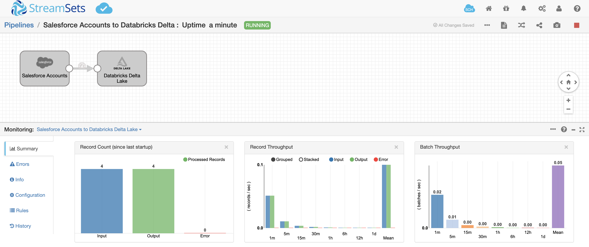

Salesforce Accounts to Databricks Delta Lake
==============================

This pipeline demonstrates how to bulk load data from Salesforce accounts into Databricks Delta Lake.

For more information, see [Loading Data into Databricks Delta Lake](https://streamsets.com/documentation/datacollector/latest/help/index.html?contextID=concept_a5b_wvk_ckb) in [StreamSets Data Collector documentation](https://streamsets.com/documentation/datacollector/latest/help/).

Prerequisites
-------------

* [StreamSets Data Collector](https://streamsets.com/products/dataops-platform/data-collector/) 3.15.0 or higher. You can [run Data Collector on your cloud provider of choice](https://streamsets.com/products/cloud/), or [download it for local use](https://streamsets.com/products/dataops-platform/data-collector/download/).
* Ensure the [pre-requisites](https://streamsets.com/documentation/datacollector/latest/help/index.html?contextID=concept_xnp_y5f_dlb "pre-requisites") for Databricks Delta Lake are complete
* Salesforce login details with appropriate permissions

Setup
-----

* [Download the pipeline](Salesforce%20Accounts%20to%20Delta%20Lake.json) and import it into Data Collector or Control Hub
* Configure all the pipeline parameters for your Salesforce and Databricks connections
* Update the Salesforce Query to retrieve desired attributes from the Salesforce object being queried.
* By default, the Databricks Delta Lake destination is configured to auto create a table and write the data in DBFS. If you'd like, update the configurations in the destination per your needs.
* Start your Databricks cluster.

Running the Pipeline
--------------------

Start the pipeline. It takes a couple of seconds to create a connection to Databricks. Once the connection is established, you should see records ingested from Salesforce Accounts and sent to Delta Lake.

