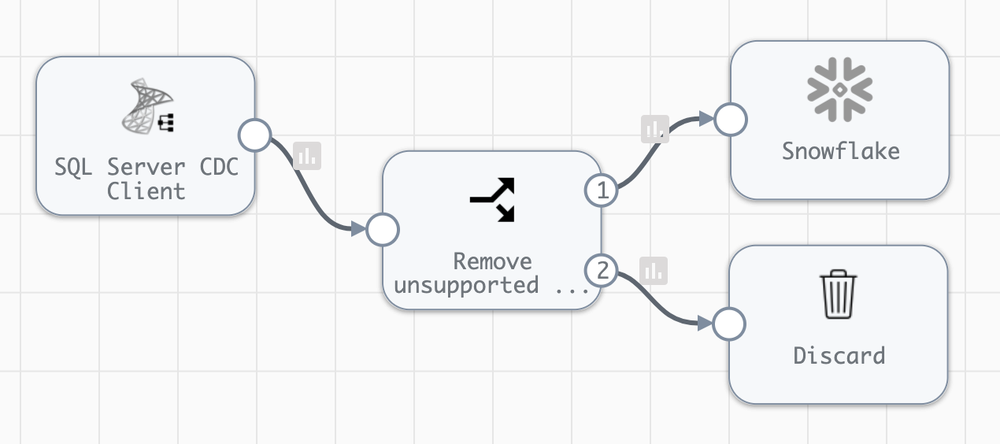

<h1>
SQL Server CDC to Snowflake
</h1>

# SQL Server CDC to Snowflake

**Important:** *These instructions assume you have access to StreamSets Data Collector (v3.15+) and have performed all the prerequisites for MySQL and Snowflake*

- For help installing [StreamSets Data Collector](https://streamsets.com/products/dataops-platform/data-collector/), see [StreamSets Data Collector Installation](https://streamsets.com/documentation/datacollector/latest/help/datacollector/UserGuide/Installation/Install_title.html).
- Your SQL Server database is enabled for Change Data Capture (CDC). For help with enabling CDC, see [About CDC - SQL Server](https://docs.microsoft.com/en-us/sql/relational-databases/track-changes/about-change-data-capture-sql-server?view=sql-server-ver15).
- For help with Snowflake prerequisites, see [Snowflake](https://streamsets.com/documentation/controlhub/latest/onpremhelp/datacollector/UserGuide/Destinations/Snowflake.html).

## OVERVIEW

This pipeline demonstrates how to read change data capture (CDC) data from a SQL Server database and replicate the changes to Snowflake. The pipeline assumes the following:
* SQL Server database is enabled for Change Data Capture.
* All tables in the database will be tracked for ingesting changes (Inserts, Updates and Deletes). If you need to track only certain tables, configure the [Capture Instance Name](https://streamsets.com/documentation/datacollector/latest/help/index.html?contextID=concept_sx3_d11_s1b) accordingly in the origin.
* Each source table will be mapped to it's corresponding table in Snowflake. If the table doesn't exist in Snowflake, it will be auto-created.
* The SQL Server CDC client generates records for multiple transaction types. The transaction type is captured in the record header as an attribute called [sdc.operation.type](https://streamsets.com/documentation/datacollector/latest/help/index.html?contextID=concept_yqg_sts_r1b):
  * 1 for Insert
  * 2 for Delete
  * 3 for Update, including updates captured after the update operation
  * 5 for unsupported operations, including updates captured before the update operation.
   The Snowflake destination handles all but one operation type, which is sdc.operation.type=5. The Stream Selector processor in the pipeline routes and discards all records with sdc.operation.type=5.

**Disclaimer:** *This pipeline is meant to serve as a template for performing SQL Server CDC to Snowflake.  Some of the parameters, tables and fields may be different for your environment and may need additional customizations.  Please consult the StreamSets documentation for full information on configuration of each stage used below.*

## PIPELINE

## DOCUMENTATION

[SQL Server CDC Origin](https://streamsets.com/documentation/datacollector/latest/help//datacollector/UserGuide/Origins/SQLServerCDC.html)

[Stream Selector Processor](https://streamsets.com/documentation/datacollector/latest/help/datacollector/UserGuide/Processors/StreamSelector.html)

[Snowflake Destination](https://streamsets.com/documentation/controlhub/latest/help/datacollector/UserGuide/Destinations/Snowflake.html)

## STEP-BY-STEP

### Step 1: Download the pipeline

[Click Here](./SQL_Server_CDC_to_Snowflake.zip?raw=true) to download the pipeline and save it to your drive.

### Step 2: Import the pipeline

Click the down arrow next to the "Create New Pipeline" and select "Import Pipeline".

Click "Browse" and locate the pipeline file you just downloaded, then click "Import"

### Step 3: Configure the parameters

Click on the pipeline you just imported to open it and click on the "Parameters" tab and fill in the appropriate information for your environment.

**Important:** *The pipeline template uses the most common default settings for things like the Snowflake region, staging location, etc. All of these are configurable and if you need to change those, you can opt to not use the built-in parameters and choose the appropriate settings yourself. Please refer to the documentation listed in this document for all the available options.*

The following parameters are set up for this pipeline:

<table>
  <tr>
   <td><code>sqlserver_jdbc_url</code>
   </td>
   <td class="entry cellrowborder" headers="d436212e756 ">JDBC URL to connect to the SQL Server database.</td>
  </tr>
  <tr>
   <td><code>sqlserver_username</code>
   </td>
   <td class="entry cellrowborder" headers="d436212e853 ">MySQL username.
</td>
  </tr>
  <tr>
   <td><code>sqlserver_password</code>
   </td>
 <td class="entry cellrowborder" headers="d436212e853 ">MySQL password. Tip: To secure sensitive information such as user tokens and passwords, you can use <a class="href" href="https://streamsets.com/documentation/datacollector/latest/help/datacollector/UserGuide/Pipeline_Configuration/RuntimeValues.html">runtime resources</a> or <a class="href" href="https://streamsets.com/documentation/datacollector/latest/help/datacollector/UserGuide/Configuration/CredentialStores.html">credential stores.</a>

</td>
  </tr>
  <tr>
   <td><code>snowflake_account</code>
   </td>
   <td class="entry cellrowborder" headers="d198512e2230 ">Snowflake account name.</td>
  </tr>
  <tr>
   <td><code>snowflake_user</code>
   </td>
   <td class="entry cellrowborder" headers="d198512e2230 ">Snowflake user name.</td>
  </tr>
  <tr>
   <td><code>snowflake_pwd</code>
   </td>
   <td class="entry cellrowborder" headers="d198512e2230 ">Snowflake password.</td>
  </tr>
  <tr>
   <td><code>snowflake_wh</code>
   </td>
   <td class="entry cellrowborder" headers="d198512e2372 ">Snowflake warehouse.</td>
  </tr>
  <tr>
   <td><code>snowflake_db</code>
   </td>
   <td class="entry cellrowborder" headers="d198512e2372 ">Snowflake database.</td>
  </tr>
  <tr>
   <td><code>snowflake_schema</code>
   </td>
   <td class="entry cellrowborder" headers="d198512e2372 ">Snowflake schema.</td>
  </tr>
  <tr>
   <td><code>snowflake_stage</code>
   </td>
   <td class="entry cellrowborder" headers="d198512e2713 ">Name of the Snowflake stage used to stage the data.
                                            
Unless using a Snowflake internal user stage, you
                                            create this stage as part of the <a class="xref">Snowflake prerequisite tasks</a>.

To use a
                                            Snowflake internal user stage, enter a tilde
                                                (<code class="ph codeph">~</code>).

</td>
  </tr>
</table>

### Step 4: Configure Key Columns in Snowflake destination

Configure each table's Key Column in the Snowflake destination. For CDC data, the MERGE command is applied on Snowflake requiring columns for matching each table. See details [here](https://streamsets.com/documentation/datacollector/latest/help/index.html?contextID=concept_w35_vsq_2gb)

### Step 5: Run the pipeline

Click the "START" button to run the pipeline.

### Step 6: Make changes to the SQL Server source tables and see the pipeline process them

