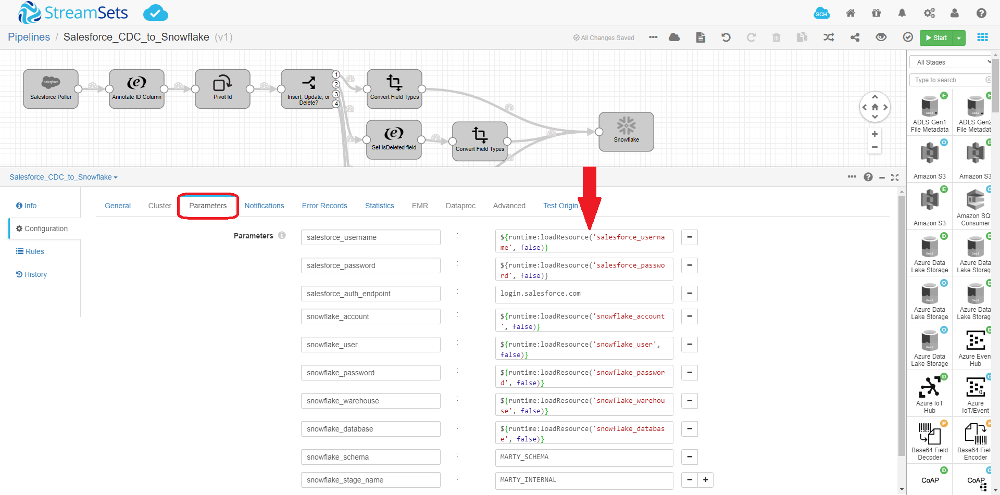
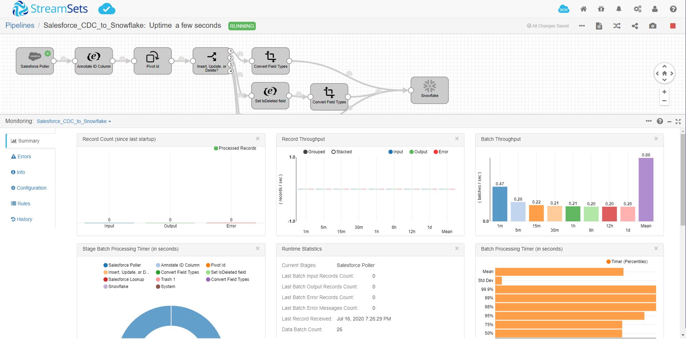
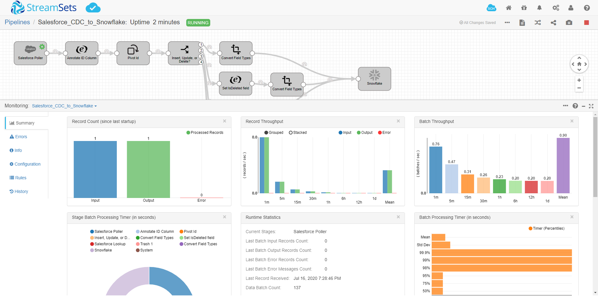

<h1>
Salesforce CDC to Snowflake
</h1>

# Salesforce CDC to Snowflake

**Important:** *These instructions assume you have access to StreamSets Data Collector (v3.15+) and have performed all the prerequisites for Salesforce and Snowflake*

- For help installing [StreamSets Data Collector](https://streamsets.com/products/dataops-platform/data-collector/), see [StreamSets Data Collector Installation](https://streamsets.com/documentation/datacollector/latest/help/datacollector/UserGuide/Installation/Install_title.html).
- For help with Salesforce prerequisites, see [Salesforce](https://streamsets.com/documentation/controlhub/latest/onpremhelp/datacollector/UserGuide/Origins/MySQLBinaryLog.html).
- For help with Snowflake prerequisites, see [Snowflake](https://streamsets.com/documentation/controlhub/latest/onpremhelp/datacollector/UserGuide/Destinations/Snowflake.html).

For more information, see [Loading Data into Databricks Delta Lake](https://streamsets.com/documentation/datacollector/latest/help/index.html?contextID=concept_a5b_wvk_ckb) in [StreamSets Data Collector documentation](https://streamsets.com/documentation/datacollector/latest/help/).

Here is a link to a short video on using this pipeline template: [Video Link](https://www.youtube.com/channel/UC_4K-__dngOCEmoZs7PVZAg)

## OVERVIEW

This pipeline demonstrates how to read change data capture (CDC) data from a Salesforce and replicate the changes to Databricks Delta Lake.

**Disclaimer:** *This pipeline is meant to serve as a template for performing Salesforce CDC to Snowflake.  Some of the parameters, tables and fields may be different for your environment and may need additional customizations.  Please consult the StreamSets documentation (linked below) for full information on configuration of each stage used below.  For example, this pipeline was used on the 'Opportunity' table from Salesforce and writes to a Snowflake table named 'Opportunity'.  Using other tables may require additional configurations.*

## USING THE TEMPLATE

NOTE: [Templates](https://streamsets.com/documentation/controlhub/latest/onpremhelp/controlhub/UserGuide/Pipelines/PipelineTemplates.html) are supported in [StreamSets Control Hub](https://streamsets.com/products/dataops-platform/control-hub/). If you do not have Control Hub, you can import the template pipeline in Data Collector but will need to do that each time you want to use the template.

## PIPELINE

## DOCUMENTATION

[Salesforce Origin](https://streamsets.com/documentation/datacollector/latest/help/datacollector/UserGuide/Origins/Salesforce.html)

[Expression Evaluator](https://streamsets.com/documentation/controlhub/latest/help/datacollector/UserGuide/Processors/Expression.html)

[Field Pivoter](https://streamsets.com/documentation/datacollector/latest/help/datacollector/UserGuide/Processors/ListPivoter.html)

[StreamSelector](https://streamsets.com/documentation/controlhub/latest/help/datacollector/UserGuide/Processors/StreamSelector.html)

[Field Type Converter](https://streamsets.com/documentation/datacollector/latest/help/datacollector/UserGuide/Processors/FieldTypeConverter.html)

[Salesforce Lookup](https://streamsets.com/documentation/datacollector/latest/help/datacollector/UserGuide/Processors/SalesforceLookup.html)

[Snowflake Destination](https://streamsets.com/documentation/controlhub/latest/help/datacollector/UserGuide/Destinations/Snowflake.html)

## STEP-BY-STEP

### Step 1: Download the pipeline

[Click Here](./Salesforce_CDC_to_Snowflake.zip?raw=true) to download the pipeline and save it to your drive.

### Step 2: Import the pipeline

Click the down arrow next to the "Create New Pipeline" and select "Import Pipeline From Archive".

Click "Browse" and locate the pipeline file you just downloaded, click "OK", then click "Import"

### Step 3: Configure the parameters

Click on the pipeline you just imported to open it and click on the "Parameters" tab and fill in the appropriate information for your environment.

**Important:** *The pipeline template uses the most common default settings for things like the region, staging location, etc. All of these are configurable and if you need to change those, you can opt to not use the built-in parameters and choose the appropriate settings yourself. Please refer to the documentation listed in this document for all the available options.*

The following parameters are set up for this pipeline:
<table>
  <tr>
   <td><code>salesforce_username</code>
   </td>
   <td class="entry cellrowborder" headers="d497702e2019 ">Salesforce username in the following email format:
                <code class="ph codeph">&lt;text&gt;@&lt;text&gt;.com</code>. </td>
  </tr>
  <tr>
   <td><code>salesforce_password</code>
   </td>
   <td class="entry cellrowborder" headers="d497702e2019 ">Salesforce password.
If the machine running Data Collector is outside the trusted
                IP range configured in your Salesforce environment, you must generate a security
                token and then set this property to the password followed by the security token.
                

For example, if the password is <code class="ph codeph">abcd</code> and the security token
                is <code class="ph codeph">1234</code>, then set this property to <kbd class="ph userinput">abcd1234</kbd>.
                For more information on generating a security token, see <a class="xref" href="https://help.salesforce.com/articleView?id=user_security_token.htm&amp;type=0" target="_blank">Reset Your Security Token</a>.

              
Tip: To
                        secure sensitive information such as user names and passwords, you can use
                              <a class="xref" href="../Pipeline_Configuration/RuntimeValues.html#concept_bs4_5nm_2s" title="Similar to runtime properties, runtime resources are values that you define in a file local to the Data Collector and call from within a pipeline. But with runtime resources, you can restrict the permissions for the files to secure information.">runtime resources</a> or <a class="xref" href="../Configuration/CredentialStores.html#concept_bt1_bpj_r1b">credential stores.</a>

</td>
  </tr>
  <tr>
   <td><code>salesforce_auth_endpoint</code>
   </td>
   <td class="entry cellrowborder" headers="d497702e2019 ">Salesforce SOAP API authentication endpoint. Enter one of the following
                values:<ul class="ul" id="task_h1n_bs3_rx__d68e4576">
                <li class="li"><code class="ph codeph">login.salesforce.com</code> - Use to connect to a Production or
                  Developer Edition organization.</li>
                <li class="li"><code class="ph codeph">test.salesforce.com</code> - Use to connect to a sandbox
                  organization.</li>
              </ul>

Default is <code class="ph codeph">login.salesforce.com</code>.

</td>
  </tr>
  <tr>
   <td><code>snowflake_account</code>
   </td>
   <td class="entry cellrowborder" headers="d198512e2230 ">Snowflake account name.</td>
  </tr>
  <tr>
   <td><code>snowflake_user</code>
   </td>
   <td class="entry cellrowborder" headers="d198512e2230 ">Snowflake user name.</td>
  </tr>
  <tr>
   <td><code>snowflake_password</code>
   </td>
   <td class="entry cellrowborder" headers="d198512e2230 ">Snowflake password.</td>
  </tr>
  <tr>
   <td><code>snowflake_warehouse</code>
   </td>
   <td class="entry cellrowborder" headers="d198512e2372 ">Snowflake warehouse.</td>
  </tr>
  <tr>
   <td><code>snowflake_database</code>
   </td>
   <td class="entry cellrowborder" headers="d198512e2372 ">Snowflake database.</td>
  </tr>
  <tr>
   <td><code>snowflake_schema</code>
   </td>
   <td class="entry cellrowborder" headers="d198512e2372 ">Snowflake schema.</td>
  </tr>
  <tr>
   <td><code>snowflake_stage_name</code>
   </td>
   <td class="entry cellrowborder" headers="d198512e2713 ">Name of the Snowflake stage used to stage the data.
                                            
Unless using a Snowflake internal user stage, you
                                            create this stage as part of the <a class="xref">Snowflake prerequisite tasks</a>.

To use a
                                            Snowflake internal user stage, enter a tilde
                                                (<code class="ph codeph">~</code>).

</td>
  </tr>
</table>

### Step 4: Run the pipeline

Click the "START" button to run the pipeline.

### Step 5: Make changes to the MySQL source table and see the pipeline process them

