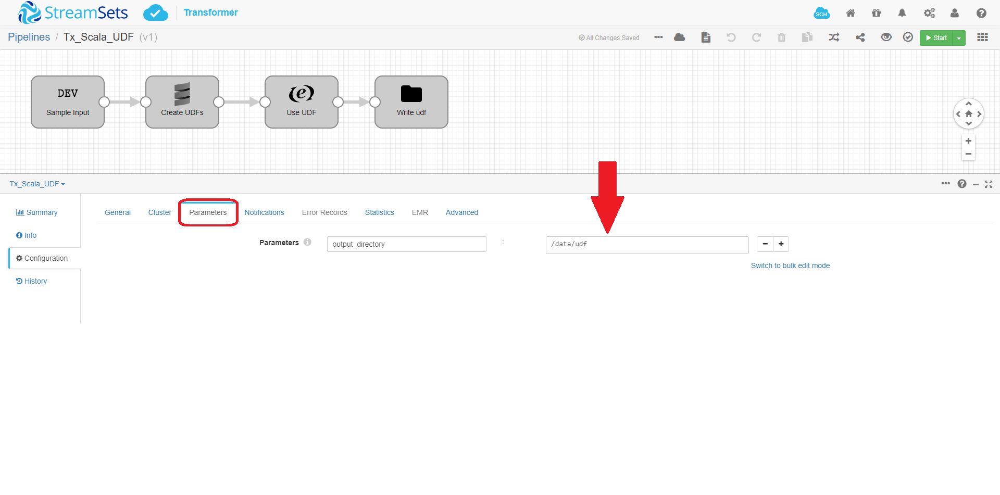

<h1><p align="center">Tx Scala UDF</p></h1>

# Tx Scala UDF

**Important:** *These instructions assume you have access to StreamSets Transformer*

- For help installing [StreamSets Transformer](https://streamsets.com/products/dataops-platform/transformer-etl/), see [StreamSets Transformer Installation](https://streamsets.com/documentation/transformer/latest/help/transformer/Installation/Installation-Title.html).

Here is a link to a short video on using this pipeline template: [Video Link](https://www.youtube.com/channel/UC_4K-__dngOCEmoZs7PVZAg)

## OVERVIEW

This pipeline demonstrates how to create, register, and use a User-Defined Function in Scala using [StreamSets Transformer](https://streamsets.com/products/dataops-platform/transformer-etl/).

The source data for this pipeline is included in the ```Dev Raw Data Source``` as an example.  Typically, you would replace these with your actual source data (JDBC/Files/etc...).  This template writes data to a file on the local file system, but you would typically replace this with your actual destination.

**Disclaimer:** *This pipeline is meant to serve as a template for creating, registering and using a User-Defined Function in Scala*

## USING THE TEMPLATE

NOTE: [Templates](https://streamsets.com/documentation/controlhub/latest/help/controlhub/UserGuide/Pipelines/PipelineTemplates.html) are supported in [StreamSets Control Hub](https://streamsets.com/products/dataops-platform/control-hub/). If you do not have Control Hub, you can import the template pipeline in Data Collector but will need to do that each time you want to use the template.

## PIPELINE


### Pipeline Description with links to documentation

Stage | Description
--- | ---
`Dev Raw Data Source` | Generates records based on user-supplied data
[Create UDFs](https://streamsets.com/documentation/transformer/latest/help/transformer/Processors/Scala.html?contextID=concept_vhf_jlj_x3b) | Creates a small example function and registers it with SparkSQL as a column function
[Use UDF](https://streamsets.com/documentation/transformer/latest/help/transformer/Processors/SparkSQLExp.html?contextID=concept_akj_gsz_mhb) | Leverages created UDF as a SparkSQL Expression Function
[Write udf](https://streamsets.com/documentation/transformer/latest/help/transformer/Destinations/File-D.html?contextID=concept_akw_2r3_xgb) | Writes data to a local file system


## STEP-BY-STEP

### Step 1: Download the pipeline

[Click Here](./Tx_Scala_UDF.zip?raw=true) to download the pipeline and save it to your drive.

### Step 2: Import the pipeline

Click the down arrow next to the "Create New Pipeline" and select "Import Pipeline From Archive".


Click "Browse" and locate the pipeline file you just downloaded, click "OK", then click "Import"


### Step 3: Configure the parameters

Click on the pipeline you just imported to open it and click on the "Parameters" tab and fill in the appropriate information for your environment.

**Important:** *For this pipeline, you only need to specify the output directory for the file.  This is on the local file system where Transformer is installed.  Make sure the directory is created and proper permissions are set so that the transformer user can create files.  By default, the directory ```/data/udf``` is used.  You can change it to anything you want.*



The following parameters are set up for this pipeline:
<table>
  </tr>
   <td><code>destination_directory</code>
   </td>
   <td class="entry cellrowborder" headers="d31669e688 "><span class="ph" id="task_rcy_b4f_dhb__d67e2186">Path to the directory for
                                            the output files.</span>
                                        <p>Use the following
                                            format:</p>
<p class="p"><code class="ph codeph">/&lt;directory&gt;</code></p>
</td>
  </tr>
</table>

### Step 4: Run the pipeline

Click the "START" button to run the pipeline.


